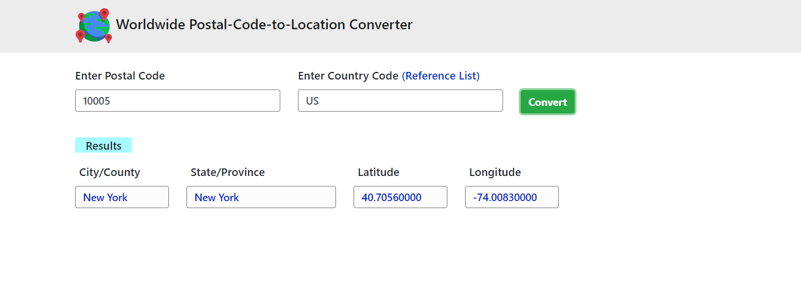

# Worldwide Postal-Code-to-Location Converter

This project is a worldwide postal-code-to-location converter implementing asynchronous requests with JavaScript and XMLHTTPRequest (AJAX) through the request made to the Zipcodebase.com API that generates JSON files with public location data based on the ZIP Code (Postal Code).

## Screenshot

## How to Use

+ Enter the Postal Code
+ Enter the Country Code, it can be written in lower case or upper case
+ Check the [Country Code Refence List](https://en.wikipedia.org/wiki/ISO_3166-1_alpha-2#Officially_assigned_code_elements) if necessary
+ Click on ***Convert*** to generate the public location data

## Technology Stack

+ JavaScript
+ AJAX
+ [Zipcodebase.com API](https://zipcodebase.com/)
+ JSON
+ HTML
+ CSS
+ Bootstrap

